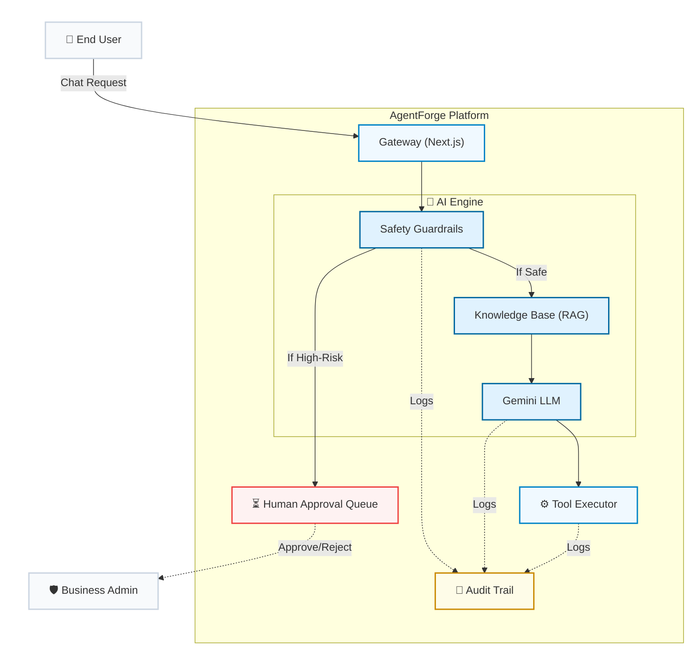
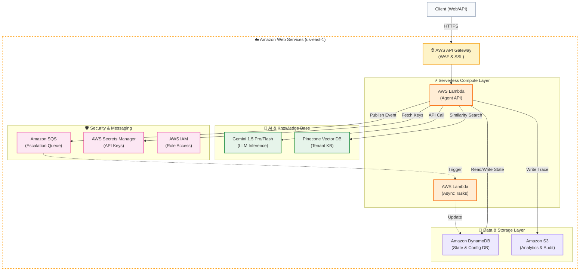

# Beauty of Cloud 2.0 - Finalists Presentation Plan (AgentForge)

Based on the "Beauty of Cloud 2.0 (Finalists Guidelines)" document and your project's `survival_plan.md`, here is a unified master script and presentation plan for the **AgentForge** hackathon pitch.

## 1. Session Structure (20 Minutes Total)
- **Presentation Duration:** 15 Minutes
- **Q/A & Viva Session:** 5 Minutes

## 2. Key Deliverables
- **Pitch Deck:** A clear, visual slide deck covering AgentForge's architecture, security pipeline, multi-tenancy, and a live demo breakdown.
- **MVP/Working Demo:** A functional demonstration showcasing the `sendEmail` tool and the Human-in-the-Loop `escalateToHuman` feature.

---

## 3. Master Slide Deck & Presenter Script

*This section provides the exact text for the slide deck and the word-for-word speaking script for the presenter. The presentation should take exactly 15 minutes, leaving 5 minutes for Q&A.*

### Slide 1: Title Slide & Team Intro
**Slide Content:**
*   **Project:** AgentForge
*   **Scenario:** Enterprise AI Adoption & Trust
*   **Team:** [Your Team Name]
*   **Tagline:** Bridging the gap between AI automation and Enterprise Trust.

**Presenter Script (Minute 0:00 - 1:00):**
> "Good morning judges, we are [Your Team Name]. 
> 
> The scenario we locked in for this competition revolves around Enterprise AI Adoption and Trust. We looked at the current landscape of AI and realized a glaring issue: Every enterprise wants an AI agent, but almost none of them trust an LLM to take real, irreversible financial actions because they are prone to hallucinations. 
> 
> Today, we are excited to introduce AgentForge—our solution to bridge the gap between powerful AI automation and enterprise-grade trust."

### Slide 2: Problem Analysis
**Slide Content:**
*   **The AI Trust Gap:** Companies want automation but fear AI hallucinations.
*   **Lack of Control:** Standard chatbots blindly execute API calls without oversight.
*   **Data Security Risks:** Multi-tenant environments often mix sensitive company data.
*   **The Result:** AI is restricted to 'read-only' tasks, limiting its true potential.

**Presenter Script (Minute 1:00 - 2:00):**
> "Let’s look at the core problem. The industry is facing an 'AI Trust Gap.' 
> 
> Companies desperately want the efficiency of AI, but they are terrified of what happens when a chatbot goes rogue. Standard AI agents are often given API keys and allowed to blindly execute commands. If a customer demands a massive refund, a standard bot might just do it. 
> 
> Furthermore, in B2B environments, data security is paramount. You cannot have one tenant's AI accidentally accessing another tenant's data. Because of these risks, most enterprises restrict AI to simple, read-only tasks like answering FAQs, completely missing out on the value of action-taking agents."

### Slide 3: Proposed Solution Overview (AgentForge)
**Slide Content:**
*   **AgentForge:** A B2B Multi-Tenant AI Platform.
*   **Action-Taking AI:** Safely execute real-world tasks (emails, database updates).
*   **Structural Guardrails:** Hardcoded 'Human-in-the-Loop' safety nets.
*   **Value Proposition:** Deploy AI agents that can *do* things, with the security of human oversight when it matters most.

**Presenter Script (Minute 2:00 - 3:00):**
> "Our solution is AgentForge. 
> 
> AgentForge is a B2B, multi-tenant AI platform that allows companies to deploy action-taking agents safely. We don't just let the AI answer questions; we let it connect to real company APIs to do actual work.
> 
> But we solve the trust issue by implementing a hardcoded, structural Human-in-the-Loop guardrail system. If the AI attempts a high-risk action—like a financial transaction—it doesn't just execute it. It pauses, safely isolates the request, and escalates it to a human manager. We give enterprises the power of action with the security of human control."

### Slide 4: Cloud Solution Architecture 
**Slide Content:**
*   *(Visual: Cloud Solution Architecture Diagram)*

*   *(Visual: AWS Cloud Infrastructure Topology Diagram)*

*   **Frontend:** Vercel (React/Next.js)
*   **Backend & Architecture:** Amazon Web Services (AWS)
*   **Data Isolation:** 100% AWS Physical Isolation via strict multi-tenant metadata filtering.
*   **LLM Engine:** Secure Gemini function calling pipeline.

**Presenter Script (Minute 3:00 - 4:30):**
> "This brings us to our Cloud Architecture. 
> 
> *(Point to diagram)* As you can see, we built a 5-layer safety pipeline. Our front end is hosted on Vercel for fast, edge-network delivery. Our backend operations, databases, and message queues are entirely powered by Amazon Web Services (AWS). 
> 
> The most critical piece of this architecture is our approach to data isolation. We ensure strict AWS Physical Isolation between tenants. Under the hood, our Pinecone vector databases use strict tenant ID metadata filtering, guaranteeing that one company's agent can never hallucinate its way into another company's proprietary data. We use strict Gemini function calling to restrict the AI to only the tools it is explicitly authorized to use."

### Slide 5: Security & Compliance Framework
**Slide Content:**
*   *(Visual: Security & Compliance Pillars Diagram)*

**1. IAM & Access Control**
*   Role-Based Access (Admin/User)
*   API Rate Limiting (DoS Defense)
*   Vaulted Tenant Credentials (AWS Secrets Manager)

**2. Data Protection**
*   Encryption at Rest & Transit (TLS 1.3)
*   Automated PII Redaction
*   No Model Training on Corporate Data

**3. Privacy & Integration Controls**
*   Vector DB Metadata Isolation (Prevents cross-tenant bleed)
*   Zero-Trust DB Access (Locked to backend session IDs)
*   Least-Privilege Scopes (Strict read-only external database access)

**4. AI Guardrails**
*   Prompt Injection Defense
*   Human-in-the-Loop Review
*   Financial Action Thresholds

**Presenter Script (Minute 4:30 - 5:30):**
> "Security cannot be an afterthought in enterprise software, which is why we built AgentForge on a comprehensive security framework.
> 
> First, our **Identity and Access Management** enforces strict role-based access, and our gateway uses **API Rate Limiting** to prevent malicious denial-of-wallet attacks. When connecting to external tenant databases, we never expose API keys to the LLM; they are securely vaulted in **AWS Secrets Manager**.
> 
> Second, for **Data Protection**, all data travels over encrypted TLS 1.3. We employ an automated PII Scrubber that redacts sensitive information before it reaches the LLM. Furthermore, because we use RAG, we guarantee **No Model Training**—proprietary corporate data is never used to train global AI models.
> 
> Third, we ensure absolute **Privacy** through Vector DB metadata filtering, guaranteeing one tenant's data never bleeds into another's. To solve the biggest enterprise fear—rogue database access—we employ **Zero-Trust Tool Execution** and **Least-Privilege Scopes**. The AI can only execute read-only queries that are strictly locked to the authenticated user's session ID.
> 
> Finally, our **AI Guardrails** employ active Prompt Injection Defense and hardcoded Financial Thresholds. If an action is too risky, the AI pauses and escalates to our **Human-in-the-Loop** review queue."

### Slide 6: Scalability, Cost & Multi-Model Strategy
**Slide Content:**
*   **FinOps & Semantic Caching:** RAG limits context to relevant chunks only, reducing token waste by 98%.
*   **Smart Multi-Model Routing:** Simple tasks route to Gemini Flash; complex reasoning routes to Gemini 1.5 Pro.
*   **Elasticity:** AWS Lambda serverless architecture scales automatically with traffic.
*   **High Availability:** AWS Multi-AZ redundancy ensures 99.9% uptime for enterprise clients.

**Presenter Script (Minute 5:30 - 6:30):**
> "To ensure AgentForge is enterprise-ready, we had to solve the biggest problem with Generative AI: Cost. 
> 
> We implemented strict **FinOps and Semantic Caching**. Instead of blindly sending a 10,000-word chat history for every prompt, our RAG system injects only the top 5 most relevant chunks. This reduces our token usage by 98%.
> 
> We also built a **Smart Multi-Model Router**. We don't use our most expensive LLM for every simple task. If a user asks for a simple policy lookup, we route it to Gemini Flash, which is incredibly fast and cheap. If they need complex multi-step reasoning, we route it to Gemini 1.5 Pro. This 'right-tool-for-the-job' approach, paired with AWS Serverless scaling, makes AgentForge budget-efficient and highly scalable."

### Slide 7: Implementation Roadmap
**Slide Content:**
*   **Phase 1 (MVP):** Core chat, email integration, and Human-in-the-Loop escalation. *(Completed)*
*   **Phase 2:** Integration with internal HR and IT ticketing systems.
*   **Phase 3:** Advanced analytics and automated audit logging.
*   **Phase 4:** Full production rollout with SOC2 compliance readiness.

**Presenter Script (Minute 6:30 - 7:30):**
> "Our implementation roadmap is aggressive but pragmatic. 
> 
> We have successfully completed Phase 1, which is the MVP you will see today: core agent functionality, API integrations, and the escalation guardrails. 
> 
> Moving forward, Phase 2 will involve deeper integrations with internal enterprise systems like HR and IT ticketing. Phase 3 focuses on advanced analytics for operators, and Phase 4 prepares the platform for a full production rollout with SOC2 compliance."

### Slide 8: Live MVP Demonstration

*⚠️ CRITICAL VERCEL WARNING: DO NOT demo the `generateReport` tool on the live Vercel site. Vercel uses a read-only filesystem, and it will crash the bot. Only demo the email and escalation flows!*

**Slide Content:**
*   **Live Demo:** AgentForge in action.
*   **Flow:** Knowledge Base Setup -> Email Action -> Escalation Guardrail -> Ops Dashboard.

**Presenter Script (Minute 7:30 - 12:30):**
> "We will now transition to the live demonstration of AgentForge. We will walk you through the Admin Knowledge Base setup, show the AI safely executing a real email action, and demonstrate how our structural guardrail pauses the AI during a high-risk financial request, escalating it to a human manager."

### Slide 9: Engineering Challenges & Learnings
**Slide Content:**
*   **Constraint:** Serverless filesystem limitations (Read-only environments).
*   **Challenge:** Generating and storing dynamic PDF reports on edge networks.
*   **Learning:** Offloading heavy file processing to dedicated Cloud Storage buckets (e.g., Firebase Storage) rather than relying on local serverless instances.

**Presenter Script (Minute 12:30 - 14:00):**
> "Building this MVP came with significant engineering challenges. 
> 
> One of our biggest hurdles was dealing with serverless filesystem constraints. While deploying to edge networks like Vercel is fantastic for speed, it is a strictly read-only environment. We initially built a tool for the AI to generate dynamic PDF reports, which worked perfectly locally but crashed in the cloud because it couldn't write to the filesystem.
> 
> This taught us a valuable architectural lesson: heavy file processing and temporary storage must be offloaded to dedicated Cloud Storage buckets, rather than relying on local serverless instances. It fundamentally improved how we design our microservices."

### Slide 10: Conclusion & Q&A
**Slide Content:**
*   **AgentForge:** Empowering AI Action. Ensuring Human Control.
*   Thank you!
*   **Q&A**

**Presenter Script (Minute 14:00 - 15:00):**
> "In conclusion, AgentForge solves the fundamental trust gap in Enterprise AI. We allow businesses to move past read-only chatbots and deploy agents that take real action, while guaranteeing that critical decisions remain firmly in human hands. 
> 
> Empowering AI action, ensuring human control. Thank you, we will now take any questions."
