# 🧠 AgentForge — Full Project Deep Dive
### BOC 2.0 · Scenario 5: AI Agent Platform for Business Automation

---

## 1. What Is This Project?

**AgentForge** is a cloud-native, **multi-tenant AI Agent Platform** built entirely on Google Cloud Platform (GCP). It solves a specific enterprise problem: businesses want AI that can *actually do things* — cancel subscriptions, look up orders, trigger refunds — not just answer questions. But raw LLMs can't be trusted to do this safely.

AgentForge is the **infrastructure layer** between "a language model that can reason" and "a business system that needs to be operated safely."

> **Tagline:** *"Deploy intelligent agents. Own the results."*

**Analogous to:** Vercel for AI Agents — businesses configure via dashboard; AgentForge handles everything underneath.

**Built for:** BOC 2.0 Competition, Scenario 5 — scored on safety, cost control, multi-tenant isolation, and observability.

---

## 2. The Core Problem

Raw LLMs fail enterprises in 6 specific ways — all covered in the current frontend UI:

| Problem | Impact | Frontend Label |
|---|---|---|
| No persistent memory across sessions | Context loss, poor UX | "No Memory" |
| No safety/guardrails | Hallucinated tool calls execute | "No Safety & Guardrails" |
| Unconstrained token costs | Bills spiral at scale | "Runaway Token Costs" |
| No audit trail | Can't explain agent decisions | "Zero Observability" |
| Shared infrastructure | One tenant breaks others | "No Multi-Tenancy" |
| 3–6 months of infra work | Engineering bottleneck | "Months to Build" |

---

## 3. Three User Personas

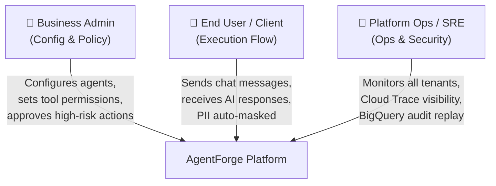

---

## 4. High-Level System Architecture (5 Layers)

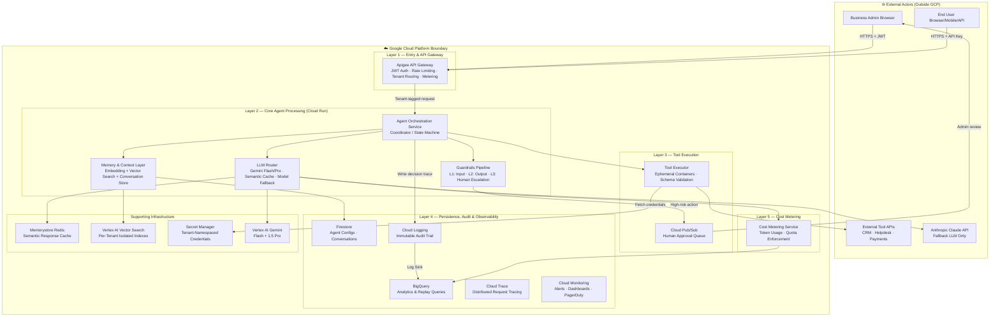

---

## 5. Request Lifecycle — Step by Step

This is the complete journey of a single user message through AgentForge.

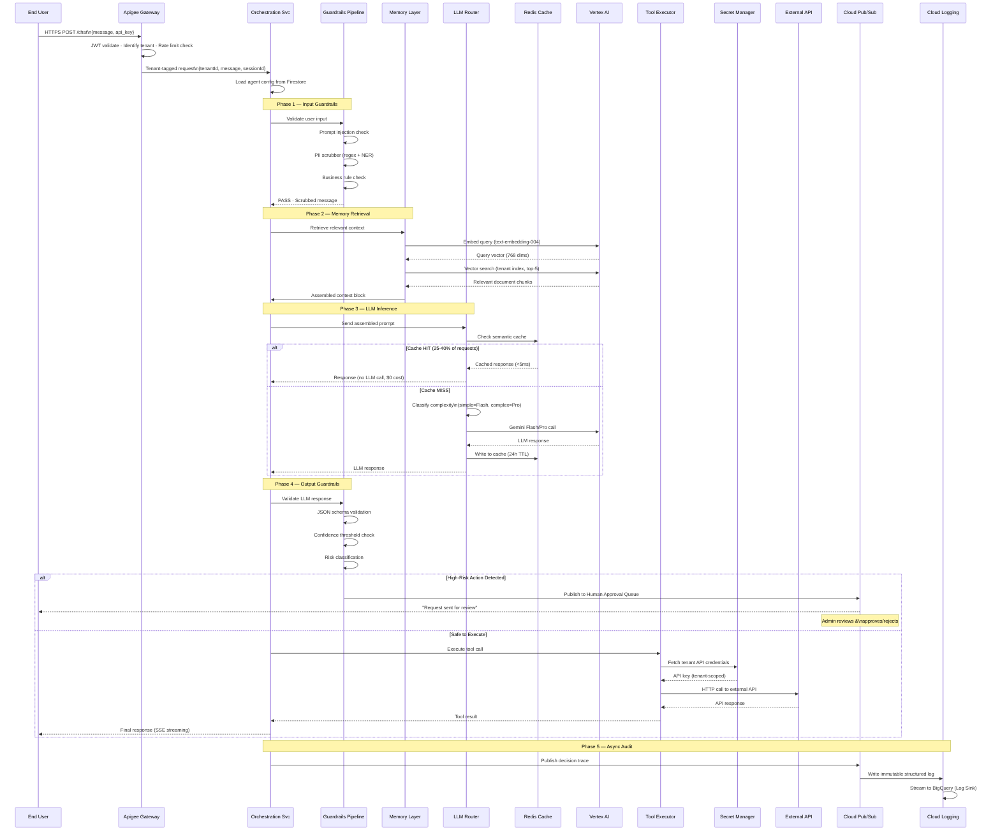

---

## 6. Database Design

### 6a. Firestore (Primary Operational DB)

Firestore uses a **hierarchical document model** with strict per-tenant namespace isolation. No service can even construct a valid path to another tenant's data.

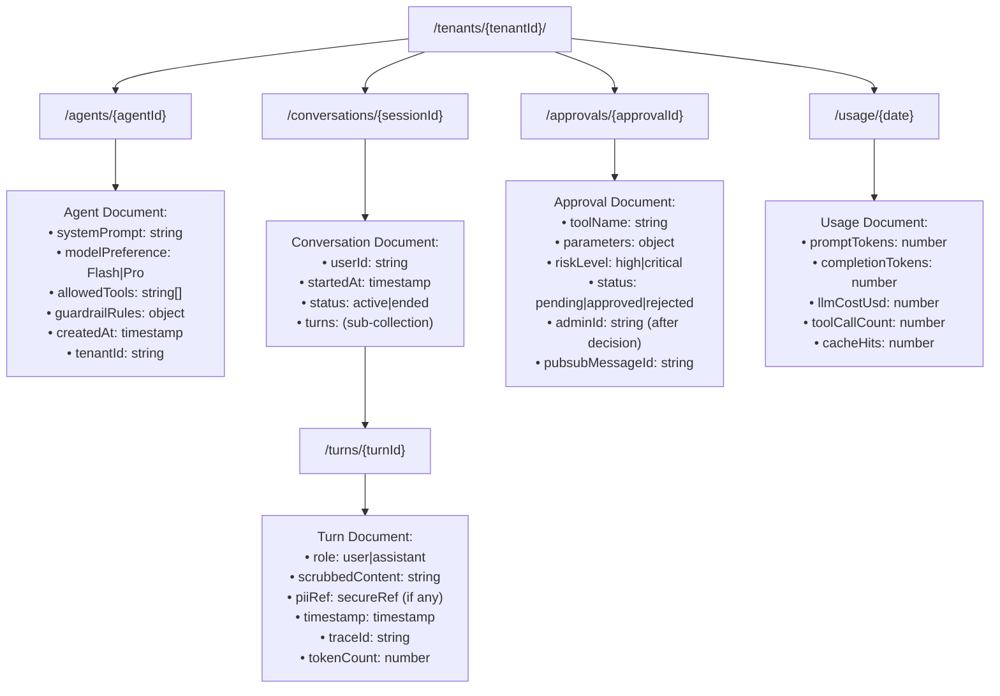

> [!IMPORTANT]
> Firestore TTL policies automatically delete conversation documents after **90 days** (configurable per tenant). No manual cleanup needed.

### 6b. Vertex AI Vector Search (Memory/RAG DB)

Each tenant gets a **completely separate vector index** — physically isolated, not just logically filtered.

```
Structure per tenant:
├── Index ID: vector_idx_{tenantId}
│   ├── Dimension: 768 (text-embedding-004)
│   ├── Approximate Neighbors Count: 5
│   ├── Distance Measure: COSINE
│   └── Documents stored as:
│       {
│         id: "chunk_{docId}_{chunkNum}",
│         embedding: float[768],
│         metadata: {
│           tenantId: string,
│           sourceDocId: string,
│           chunkText: string (first 200 chars),
│           indexedAt: timestamp
│         }
│       }
```

**Query flow:** User query → embed → cosine similarity search against tenant's index → top-5 chunks with score ≥ 0.92 threshold → inject into LLM prompt.

> [!NOTE]
> Conversation history is **never embedded** into Vector Search — only business-uploaded knowledge base documents. This prevents conversation data from leaking into the vector store.

### 6c. BigQuery (Audit & Analytics)

Append-only, tamper-evident audit store. INSERT-only permissions — no service can UPDATE or DELETE.

```sql
-- audit_traces table schema
CREATE TABLE agent_audit.traces (
    trace_id        STRING NOT NULL,
    tenant_id       STRING NOT NULL,
    session_id      STRING NOT NULL,
    step_order      INT64 NOT NULL,
    step_type       STRING,          -- INPUT_RECEIVED, MEMORY_RETRIEVAL, LLM_CALL, GUARDRAILS_OUTPUT_CHECK, TOOL_EXEC, AUDIT_SINK
    timestamp       TIMESTAMP NOT NULL,
    prompt_tokens   INT64,
    completion_tokens INT64,
    model_used      STRING,          -- gemini-flash, gemini-pro, claude-3-5-sonnet
    cache_hit       BOOL,
    retrieved_chunk_ids ARRAY<STRING>,
    similarity_scores   ARRAY<FLOAT64>,
    tool_called     STRING,
    tool_parameters STRUCT<...>,
    guardrail_action STRING,         -- PASS, BLOCK, ESCALATE_TO_HUMAN
    pii_detected    BOOL,
    scrubbed_message STRING,         -- NEVER raw PII
    response_preview STRING,
    duration_ms     INT64,
    llm_cost_usd    FLOAT64
)
PARTITION BY DATE(timestamp)
CLUSTER BY tenant_id, step_type;
```

### 6d. Memorystore Redis (Semantic Cache)

```
Cache key: "scache:{tenantId}:{embeddingHash}"
Cache value: {
  "response": "Your order #1234 is currently being processed...",
  "model": "gemini-flash",
  "tokens_saved": 760,
  "cached_at": 1727888400,
  "hit_count": 0
}
TTL: 86400 seconds (24 hours)
Similarity threshold: cosine distance < 0.08 (i.e., similarity > 0.92)
```

Also used for:
- Agent config cache (5-min TTL) — Firestore fallback avoidance
- Active session conversation cache (30-min TTL) — hot path optimization
- Per-tenant rate limit counters (sliding window)

---

## 7. The 3-Layer Guardrails Pipeline (Deep Dive)

The most critical safety system. Runs **before** input reaches the LLM and **after** LLM response is generated.

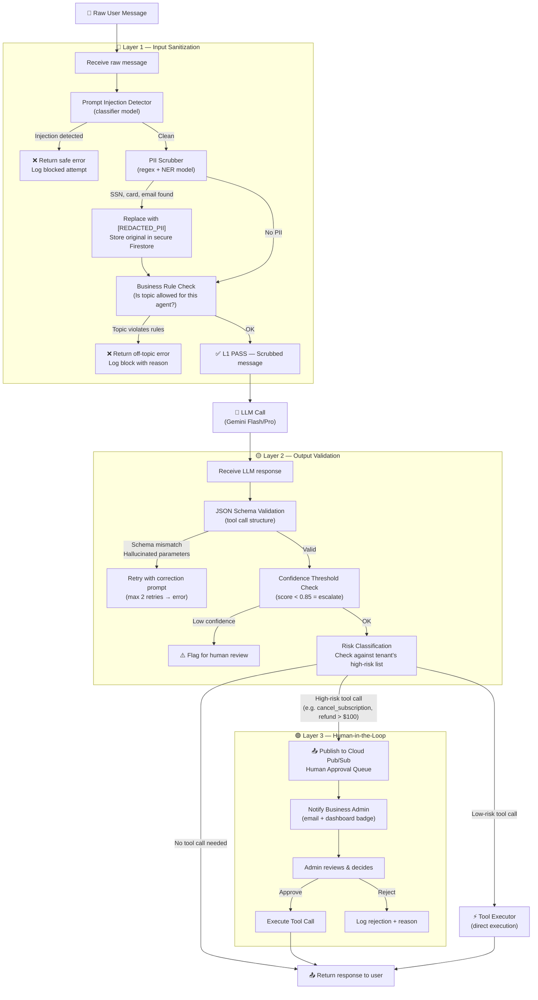

---

## 8. RAG Memory System (Deep Dive)

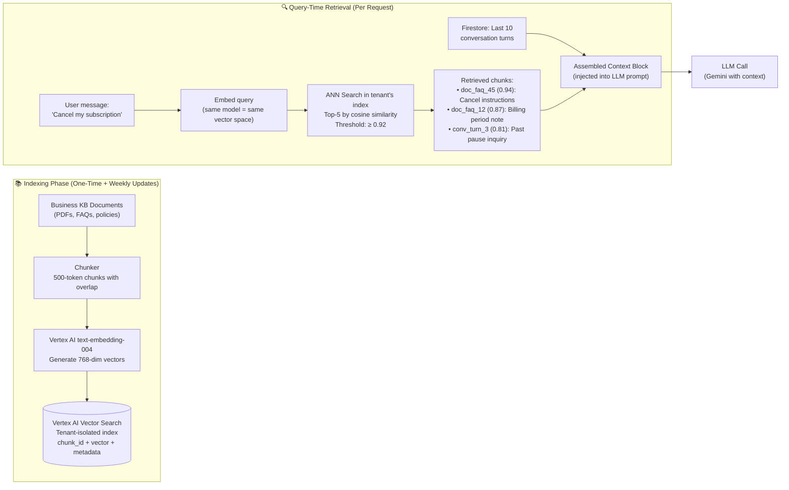

**Why this matters:**
- Without RAG: Every LLM call includes ALL conversation history → 10,000+ tokens → $0.035/call → context window exceeded at scale
- With RAG: Only top-5 relevant chunks → ~600 tokens total → $0.00045/call → **98.7% cost reduction on context**

---

## 9. LLM Routing Logic

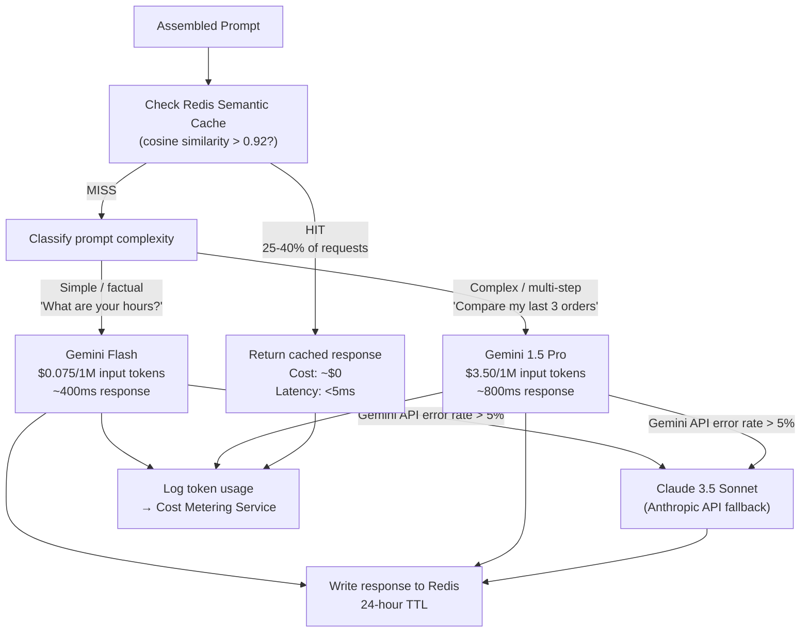

**Routing split at pilot scale:**
- 65% → Gemini Flash ($6.58/month)
- 30% → Gemini Pro ($118.13/month)
- 5% → Semantic cache ($0/month)
- **Without routing (all to Pro): ~$390/month — routing saves $232/month (59%)**

---

## 10. Tool Execution Security

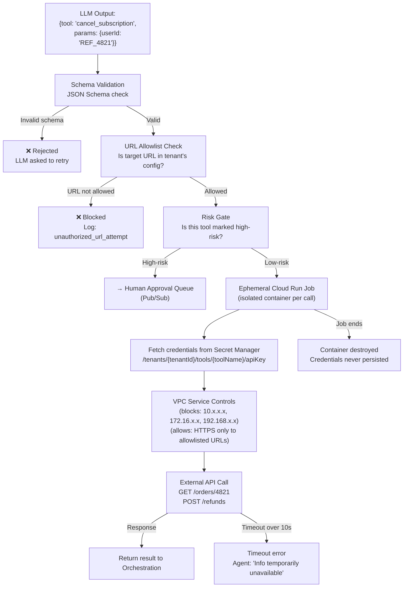

---

## 11. Multi-Tenant Isolation Architecture

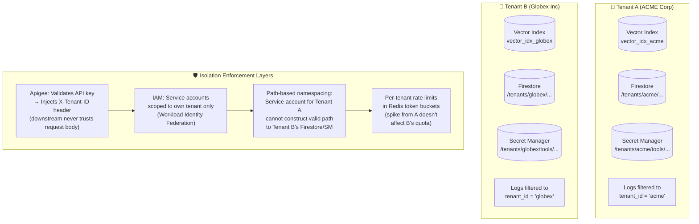

**Isolation is structural, not just policy-based:**
- A misconfigured query in Tenant A's code cannot return Tenant B's vectors — they're in different indexes
- A bug in the application layer cannot access wrong tenant secrets — IAM prevents it at the infrastructure level
- A traffic spike from Tenant A cannot consume Tenant B's LLM quota — token buckets are per-tenant in Redis

---

## 12. Observability & Decision Traces

Every agent invocation produces a **Decision Trace** — a linked chain of structured log entries that explains *why* the agent did what it did.

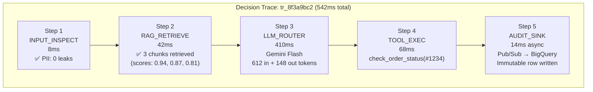

**Streaming to BigQuery enables SQL queries like:**
```sql
-- Why did agent block this tool call?
SELECT step_details FROM agent_traces
WHERE trace_id = 'tr_8f3a9bc2' ORDER BY step_order;

-- Which knowledge docs influence responses most?
SELECT chunk_id, COUNT(*) as hits, AVG(similarity_score) as avg_score
FROM agent_traces, UNNEST(retrieved_chunk_ids) as chunk_id
WHERE tenant_id = 'acme' AND timestamp > TIMESTAMP_SUB(CURRENT_TIMESTAMP(), INTERVAL 7 DAY)
GROUP BY chunk_id ORDER BY hits DESC LIMIT 20;
```

---

## 13. Frontend Architecture (Current UI)

The frontend is a **Next.js 14 App Router** application with Tailwind CSS and Material Symbols icons. It is a **marketing/demo site** — not the actual admin dashboard (which is mentioned but not yet built).

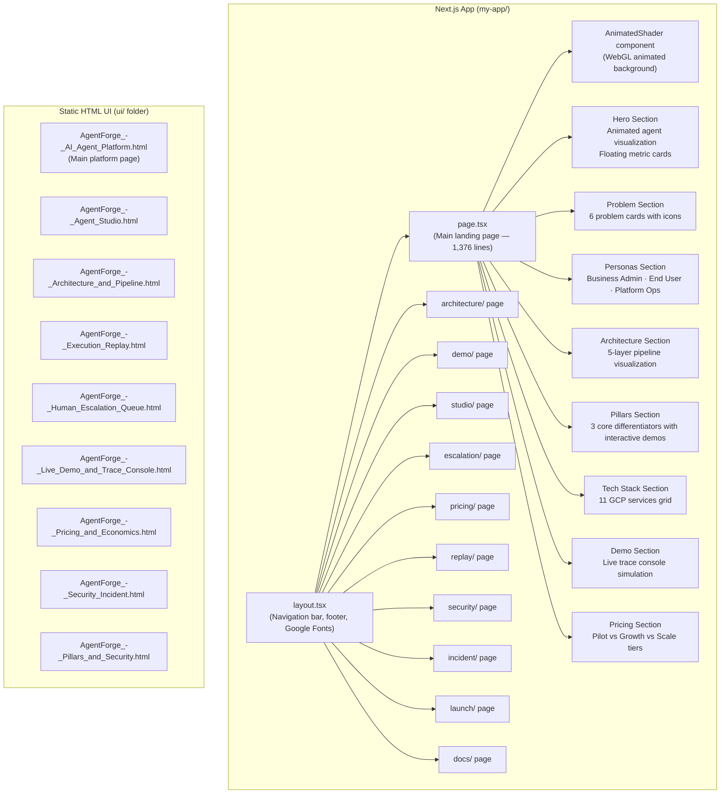

**Design System:**
- **Fonts:** Geist (headings), Inter (body), JetBrains Mono (code)
- **Color Palette:** Material Design 3 tokens with custom GCP-inspired indigo/violet/teal scheme
- **Primary:** `#3525cd` (deep indigo) → `#712ae2` (violet) → `#71f8e4` (teal)
- **Motion:** Tailwind `animate-ping`, `animate-pulse`, `animate-bounce` for live-feel indicators

---

## 14. Infrastructure & GCP Services Map

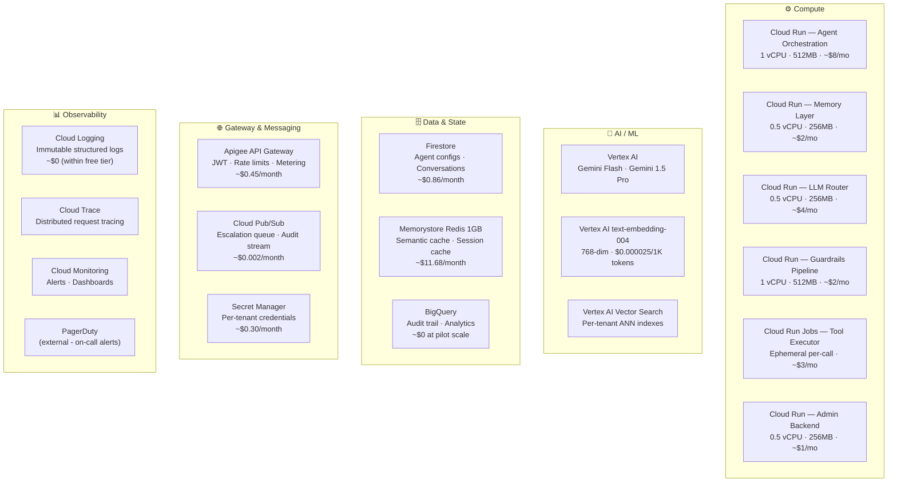

---

## 15. Cost Analysis

### Pilot Scale (10 Tenants, 15,000 conversations/month)

| Component | Monthly Cost | Notes |
|---|---|---|
| LLM Inference (Gemini Flash 65%) | $6.58 | 29.25M input + 14.63M output tokens |
| LLM Inference (Gemini Pro 30%) | $118.13 | 13.5M input + 6.75M output tokens |
| Cloud Run (all 6 services) | $20.00 | Scales to zero outside hours |
| Memorystore Redis (1GB) | $11.68 | Fixed baseline |
| Firestore | $0.86 | Read + write ops |
| Vertex AI Vector Search | $0.16 | 50K vectors + 75K queries |
| Vertex AI Embedding | $0.25 | Query embeddings |
| Apigee | $0.45 | 150K API calls |
| Secret Manager | $0.30 | 10 tenant secrets |
| Cloud Pub/Sub | $0.002 | 37.5MB/month |
| Cloud Logging + BigQuery | $0.00 | Within free tier |
| **TOTAL** | **~$158/month** | **$15.84/tenant · $0.0106/conversation** |

### Cost Scaling Trajectory

| Scale | Tenants | Conversations/mo | Monthly Cost | Cost/Tenant |
|---|---|---|---|---|
| Pilot | 10 | 15,000 | ~$158 | ~$15.84 |
| Early Growth | 100 | 500,000 | ~$3,200 | ~$32 |
| Scale | 1,000 | 10,000,000 | ~$48,000 | ~$48 |

---

## 16. Security Architecture Summary

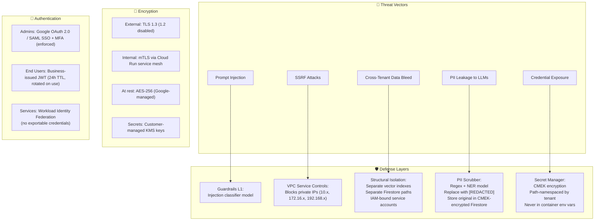

---

## 17. Resilience & Availability Design

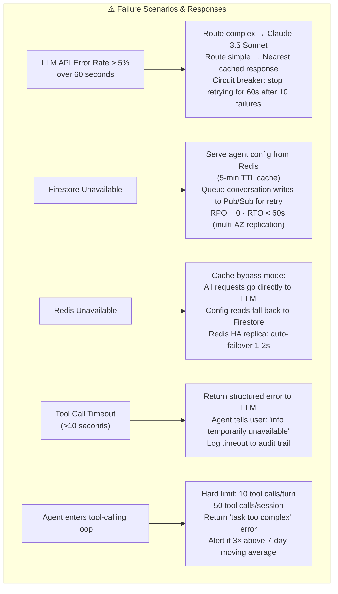

**Disaster Recovery:**
- Firestore: daily export to Cloud Storage (30-day retention)
- Vector Search: weekly snapshots (4-week retention)
- Secret Manager: 90-day version history
- Full regional failover RTO: 4 hours (pilot) → <1 minute (future multi-region)

---

## 18. Performance Targets

### Latency Budget (Typical Request, No Tool Call, Cache Miss)

| Step | Service | Latency |
|---|---|---|
| API routing & auth | Apigee | 10–20ms |
| Embedding generation | Vertex AI | 30–50ms |
| Vector search | Vertex AI | 20–40ms |
| Input guardrails | Guardrails Pipeline | 15–25ms |
| LLM call (Gemini Flash) | Vertex AI | 400–800ms |
| Output guardrails | Guardrails Pipeline | 10–20ms |
| **Total P50** | End-to-end | **~550ms** |

> [!TIP]
> Audit log writing is **asynchronous via Pub/Sub** — it contributes 0ms to user-facing latency. For chat interfaces, **Server-Sent Events** streaming delivers first tokens within 200–300ms.

### Cache Performance

| Type | Latency | Cost |
|---|---|---|
| Semantic cache hit | <5ms | ~$0 |
| Gemini Flash call | 400–800ms | $0.00045 |
| Gemini Pro call | 600–1200ms | $0.0106 |

---

## 19. What the Frontend Currently Demos

The Next.js frontend (`my-app/`) is a sophisticated **presentation/demo site** that visually demonstrates every major concept:

| Section | What It Shows |
|---|---|
| **Hero** | Animated agent core with live floating metric cards (guardrail score, cache %, tool manifest JSON) |
| **Problem** | 6 pain cards explaining why raw LLMs fail enterprises |
| **Personas** | 3 user types with their specific capabilities and access endpoints |
| **Architecture** | 5-layer pipeline visualization with connecting animated dashes |
| **Pillar 1** | Interactive guardrail flow simulator (L1→L2→L3 with example trace) |
| **Pillar 2** | Isolated vector cluster map showing 2 tenant namespaces with cryptographic boundary |
| **Pillar 3** | Decision timeline (5 steps, 542ms trace visualization) |
| **Tech Stack** | 11 GCP service cards with descriptions |
| **Ops Console** | Simulated metrics: 42 active agents, 542ms P50, 0.02% guardrail blocks, $158.41/month |
| **Pricing** | Pilot/Growth/Scale tiers with per-conversation cost calculations |

The static HTML files in `ui/` represent prototype versions of specific platform screens (Agent Studio, Execution Replay, Escalation Queue, etc.).

---

## 20. Future Roadmap (Priority Order)

```mermaid
gantt
    title AgentForge Development Roadmap
    dateFormat  YYYY-Q
    axisFormat  %Y Q%q
    section Current
    BOC 2.0 Submission              :done, 2026-Q3, 2026-Q3
    Marketing/Demo Frontend         :done, 2026-Q3, 2026-Q3
    section Priority 1
    Multi-turn Planning + SSE       :2026-Q4, 2027-Q1
    section Priority 2
    Agent Template Marketplace      :2027-Q1, 2027-Q2
    section Priority 3
    Fine-tuning Pipeline            :2027-Q2, 2027-Q3
    section Priority 4
    Real-time KB Streaming Updates  :2027-Q2, 2027-Q3
    section Priority 5
    Multi-region Active-Active      :2027-Q3, 2027-Q4
```

---

## 21. Known Honest Limitations

> [!WARNING]
> These are explicitly acknowledged in the proposal — transparency is part of the design philosophy.

1. **LLM non-determinism** — Guardrails reduce but cannot eliminate subtly wrong answers that pass all safety checks. Ongoing human review of sampled interactions is required.

2. **Complex multi-session planning** — The architecture handles single-turn and short multi-step sequences well, but not long-running plans spanning hours/days (would require persistent task queue).

3. **Knowledge base freshness** — Vector index is re-indexed weekly. For businesses with daily-changing info, weekly re-indexing is too slow (real-time streaming would add complexity).

4. **Configuration dashboard UX** — The backend is deeply designed; the business-facing configuration UI is mentioned but not built in this proposal scope.

---

## 22. File Map Reference

| Path | Description |
|---|---|
| [`BOC2.0_Proposal_Submission.md`](file:///c:/Users/ADMIN/Desktop/BOC-2.0/BOC2.0_Proposal_Submission.md) | Complete 10-section proposal document |
| [`BOC2.0_Proposal/00_Overview_and_Ideas.md`](file:///c:/Users/ADMIN/Desktop/BOC-2.0/BOC2.0_Proposal/00_Overview_and_Ideas.md) | Strategy guide, key ideas, scoring targets |
| [`BOC2.0_Proposal/Section_03_Architecture_Diagram.md`](file:///c:/Users/ADMIN/Desktop/BOC-2.0/BOC2.0_Proposal/Section_03_Architecture_Diagram.md) | Detailed 5-layer architecture spec |
| [`BOC2.0_Proposal/Section_04_Technology_Choices.md`](file:///c:/Users/ADMIN/Desktop/BOC-2.0/BOC2.0_Proposal/Section_04_Technology_Choices.md) | Full tech stack justification |
| [`BOC2.0_Proposal/Section_06_Security_Privacy.md`](file:///c:/Users/ADMIN/Desktop/BOC-2.0/BOC2.0_Proposal/Section_06_Security_Privacy.md) | Security architecture deep dive |
| [`BOC2.0_Proposal/Section_07_Cost_Estimate.md`](file:///c:/Users/ADMIN/Desktop/BOC-2.0/BOC2.0_Proposal/Section_07_Cost_Estimate.md) | Detailed cost breakdown with formulas |
| [`BOC2.0_Proposal/Section_09_Monitoring_Observability.md`](file:///c:/Users/ADMIN/Desktop/BOC-2.0/BOC2.0_Proposal/Section_09_Monitoring_Observability.md) | Decision traces + monitoring spec |
| [`my-app/app/page.tsx`](file:///c:/Users/ADMIN/Desktop/BOC-2.0/my-app/app/page.tsx) | Main landing page (1,376 lines) |
| [`my-app/app/layout.tsx`](file:///c:/Users/ADMIN/Desktop/BOC-2.0/my-app/app/layout.tsx) | Navigation, header, footer |
| [`my-app/app/globals.css`](file:///c:/Users/ADMIN/Desktop/BOC-2.0/my-app/app/globals.css) | Design tokens, color palette |
| [`ui/`](file:///c:/Users/ADMIN/Desktop/BOC-2.0/ui) | 12 static HTML prototype screens |
